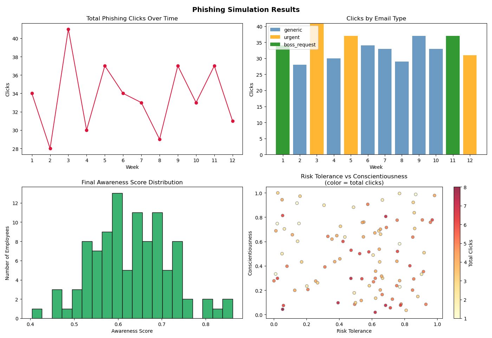

# Phishing Risk Simulator

Agent-based simulation modeling phishing susceptibility across a 100-person 
organization over 12 weeks, built on IO psychology and behavioral science principles.

## Overview
Models employee phishing susceptibility using Big Five personality traits 
(conscientiousness, risk tolerance), stress-urgency interaction effects, and 
separate knowledge vs. vigilance decay curves.

## Key Features
- 100 agent employees with unique personality profiles
- Three phishing email types: generic, urgent, authority-based
- Event-driven training triggered only by click behavior
- SOC detection layer with email-type sensitivity
- Four-panel results dashboard

## Simulation Output

## Sample Run Data

| Week | Email Type    | Clicks | SOC Detected | High-Risk | Low-Conscientious |
|------|---------------|--------|---------------|-----------|---------------------|
| 1    | boss_request  | 34     | 22            | 10        | 17                   |
| 2    | generic       | 28     | 10            | 10        | 15                   |
| 3    | urgent        | 41     | 28            | 14        | 19                   |
| 4    | generic       | 30     | 14            | 9         | 11                   |
| 5    | urgent        | 37     | 26            | 16        | 15                   |
| 6    | generic       | 34     | 11            | 5         | 17                   |
| 7    | generic       | 33     | 16            | 9         | 14                   |
| 8    | generic       | 29     | 13            | 10        | 10                   |
| 9    | generic       | 37     | 12            | 9         | 14                   |
| 10   | generic       | 33     | 19            | 9         | 10                   |
| 11   | boss_request  | 37     | 23            | 11        | 19                   |
| 12   | urgent        | 31     | 18            | 10        | 11                   |

## Background
Built as a portfolio project bridging an MA in IO Psychology with a 
Security+ certification. Designed to demonstrate how behavioral science 
applies to human risk modeling in cybersecurity contexts.

## Requirements
- Python 3.x
- matplotlib
- numpy

## Usage
python3 simulation.py
