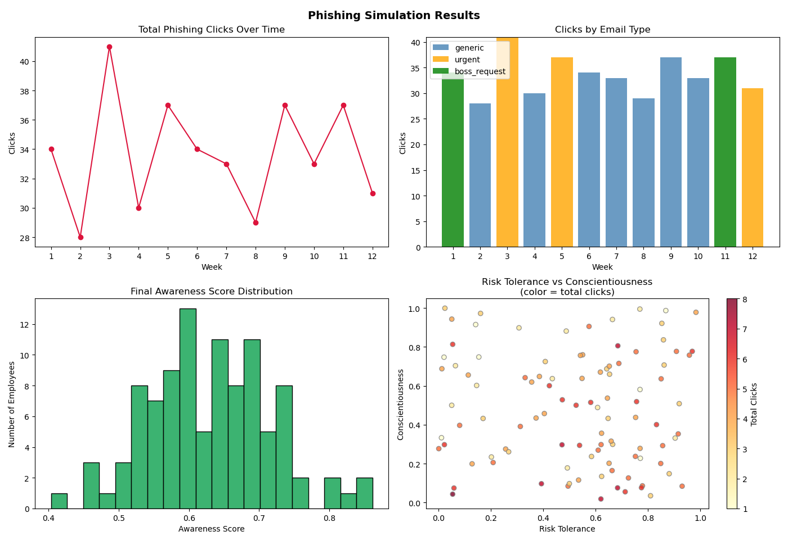

# Phishing Risk Simulator

Agent-based simulation modeling phishing susceptibility across a 100-person simulated organization over 12 weeks, exploring how I-O psychology and behavioral science concepts apply to human risk in cybersecurity.

## Overview
Models employee phishing susceptibility using personality/behavioral traits (conscientiousness and risk tolerance), stress-urgency interaction effects, authority-based email characteristics, and knowledge vs. awareness decay curves. A simulated SOC detection layer operates independently of the behavioral model.

## Key Features
- 100 agent employees with unique personality profiles
- Three phishing email types: generic, urgent, authority-based
- Event-driven training triggered only by click behavior
- SOC detection layer with email-type sensitivity
- Four-panel results dashboard

## Simulation Output

## Sample Run Data

| Week | Email Type    | Clicks | SOC Detected | High-Risk | Low-Conscientious |
|------|---------------|--------|---------------|-----------|---------------------|
| 1    | boss_request  | 34     | 22            | 10        | 17                   |
| 2    | generic       | 28     | 10            | 10        | 15                   |
| 3    | urgent        | 41     | 28            | 14        | 19                   |
| 4    | generic       | 30     | 14            | 9         | 11                   |
| 5    | urgent        | 37     | 26            | 16        | 15                   |
| 6    | generic       | 34     | 11            | 5         | 17                   |
| 7    | generic       | 33     | 16            | 9         | 14                   |
| 8    | generic       | 29     | 13            | 10        | 10                   |
| 9    | generic       | 37     | 12            | 9         | 14                   |
| 10   | generic       | 33     | 19            | 9         | 10                   |
| 11   | boss_request  | 37     | 23            | 11        | 19                   |
| 12   | urgent        | 31     | 18            | 10        | 11                   |

## Background
Built as a portfolio project connecting an MA in Industrial-Organizational Psychology with a CompTIA Security+ certification. The goal is to explore how behavioral science can inform security awareness training and human risk analysis.

## Requirements
- Python 3.x
- matplotlib
- numpy

## Usage
python3 simulation.py

## Development Notes
This project was built using AI tools, which suggested the model variables and wrote the Python implementation. The author ran the simulation, reviewed the outputs, evaluated the model's assumptions using I-O psychology knowledge, and wrote the findings and security awareness recommendations.

## Limitations
Results reflect the assumptions built into the model and use simulated data. They illustrate how these factors could interact and are not evidence about real-world employee behavior.
